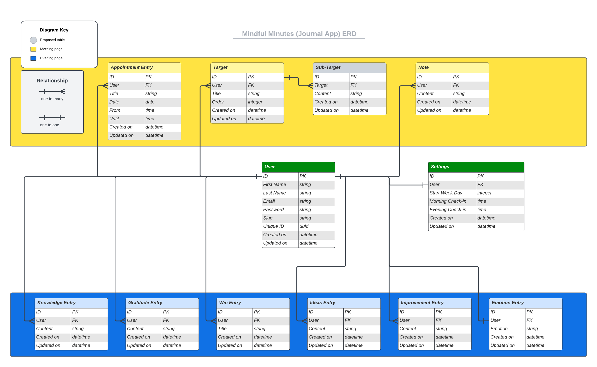

<!-- omit from toc -->
# Mindful Minutes

<!-- omit from toc -->
## Table of Contents
- [Product Information](#product-information)
- [UX / UI Design](#ux--ui-design)
  - [Design Thinking](#design-thinking)
  - [5 Planes of Design](#5-planes-of-design)
  - [Future Implementations](#future-implementations)
  - [Accessibility](#accessibility)
- [Technologies Used](#technologies-used)
  - [Stack](#stack)
  - [Frameworks, Libraries \& Additional Programs/Software used](#frameworks-libraries--additional-programssoftware-used)
- [Remote \& Local Deployment](#remote--local-deployment)
  - [Remote Deployment](#remote-deployment)
    - [Create Heroku App (via the Dashboard)](#create-heroku-app-via-the-dashboard)
    - [Create new PostgreSQL Database Instance](#create-new-postgresql-database-instance)
  - [Local Deployment](#local-deployment)
  - [Contributing](#contributing)
- [Data Models](#data-models)
  - [Schematics](#schematics)
- [Testing](#testing)
  - [Django Test Driven Development using REST Framework](#django-test-driven-development-using-rest-framework)
  - [User experience](#user-experience)
  - [Bugs \& Fixes](#bugs--fixes)
  - [Lighthouse](#lighthouse)
  - [Validator Testing](#validator-testing)
- [Credits](#credits)
  - [References](#references)
  - [Code Used](#code-used)
  - [References \& Resources](#references--resources)
    - [Agile](#agile)
    - [Deployment](#deployment)
    - [CI / CD](#ci--cd)
  - [Content](#content)
  - [Media](#media)
  - [Acknowledgements](#acknowledgements)

## Product Information

The app is designed to help cultivate a habit of daily introspection and self-reflection. By using the app, the user can establish a routine of engaging with their thoughts, goals and achievements every current day and evening.

The primary goal of the Mindful Minutes App is to encourage users to build a habit of checking in daily and reflecting on their experiences. To reinforce this habit, the app allows users to create, edit, delete and access their current day's journal entries while keeping the previous days' entries in a read-only mode. This approach ensures that users focus on the present, fostering a send of mindfulness and self-awareness.

## UX / UI Design

For further details of the design process, please see:

### [Design Thinking](docs/ui-ux/design-thinking/design-thinking.md)

### [5 Planes of Design](docs/ui-ux/five-planes/five-planes.md)

### Future Implementations

### Accessibility

## Technologies Used

### Stack

- HTML5
- CSS3
- JavaScript
- Python

### Frameworks, Libraries & Additional Programs/Software used

- Django

## Remote & Local Deployment

[Agile User Story Master on Google Sheets](https://docs.google.com/spreadsheets/d/1AhkEDuU5mDY9n6TMRGyk5BchJ2ijZUxiFlvbauW9HUE/edit?usp=sharing) was created from a template supplied by our Cohort October 2022 Tutor, Rebecca Tracey-Timoney.

```shell
pip install django

pip install gunicorn # Server used to run Django on Heroku
```

### Remote Deployment

#### Create Heroku App (via the Dashboard)

[heroku _create_app.webm](https://github.com/halfpintutopia/mindful-minutes/assets/30613818/17142ef0-b723-4652-a0a9-53acdbcd5ce9)

1. Login
2. From the Dashboard, click the "New" button
3. Choose "Create new app" from drop down menu
4. Give the app a unique name, it *must* be unique otherwise Heroku complains
5. Choose the region appropriate to you
6. Click the "Create app" button

#### Create new PostgreSQL Database Instance

[heroku _create_app.webm](https://github.com/halfpintutopia/mindful-minutes/assets/30613818/a5b700b0-ca1a-4eb8-9180-9dd0a854e6b1)

1. Login
2. Click "Create New Instance" button
3. Set up plan
   1. Provide a name
   2. Select the _Tiny Turtle (Free)_ plan
   3. Add tags if needed
4. Click "Select Region" button
   1. Choose the data center closest to you
5. Click the "Review" button
6. Click the "Create instance" button
7. From the list of instances on your dashboard, click the name of the new instance
8. Copy the URL from from the Details page and paste this link into your settings.py file in your Django project

### Local Deployment

### Contributing

## Data Models
### Schematics



For the diagram on [LucidChart](https://lucid.app), click [here](https://lucid.app/documents/view/eceb8ec6-75f3-4138-9efa-b05138d3aad4)


<details>
  <summary>Entity Relationship in PostgreSQL</summary>

  ```sql
  CREATE TABLE "user" (
    "id" PK,
    "first_name" string,
    "last_name" string,
    "email" string,
    "password" string,
    "created_on" datetime,
    "updated_on" datetime
  );

  CREATE TABLE "optimise" (
    "id" PK,
    "user" FK,
    "content" string,
    "created_on" datetime,
    "updated_on" datetime,
    CONSTRAINT "FK_optimise.user"
      FOREIGN KEY ("user")
        REFERENCES "user"("id")
  );

  CREATE TABLE "notes" (
    "id" PK,
    "user" FK,
    "content" string,
    "created_on" datetime,
    "updated_on" datetime,
    CONSTRAINT "FK_notes.user"
      FOREIGN KEY ("user")
        REFERENCES "user"("id")
  );

  CREATE TABLE "thankful" (
    "id" PK,
    "user" FK,
    "content" string,
    "created_on" datetime,
    "updated_on" datetime,
    CONSTRAINT "FK_thankful.user"
      FOREIGN KEY ("user")
        REFERENCES "user"("id")
  );

  CREATE TABLE "settings" (
    "id" PK,
    "user" FK,
    "verified" boolean,
    "start_week_day" string,
    "morning_check_in" time,
    "evening_check_in" time,
    "created_on" datetime,
    "updated_on" datetime
  );

  CREATE TABLE "targets" (
    "id" PK,
    "user" FK,
    "title" string,
    "order" integer,
    "created_on" datetime,
    "updated_on" datetime,
    CONSTRAINT "FK_targets.user"
      FOREIGN KEY ("user")
        REFERENCES "user"("id")
  );

  CREATE TABLE "sub_targets" (
    "id" PK,
    "target" FK,
    "content" string,
    "created_on" datetime,
    "updated_on" datetime,
    CONSTRAINT "FK_sub_targets.target"
      FOREIGN KEY ("target")
        REFERENCES "targets"("id")
  );

  CREATE TABLE "wins" (
    "id" PK,
    "user" FK,
    "content" string,
    "created_on" datetime,
    "updated_on" datetime,
    CONSTRAINT "FK_wins.user"
      FOREIGN KEY ("user")
        REFERENCES "User"("id")
  );

  CREATE TABLE "ideas" (
    "id" PK,
    "user" FK,
    "content" string,
    "created_on" datetime,
    "updated_on" datetime,
    CONSTRAINT "FK_ideas.user"
      FOREIGN KEY ("user")
        REFERENCES "user"("id")
  );

  CREATE TABLE "learnt" (
    "id" PK,
    "user" FK,
    "content" string,
    "created_on" datetime,
    "updated_on" datetime,
    CONSTRAINT "FK_learnt.user"
      FOREIGN KEY ("user")
        REFERENCES "user"("id")
  );

  CREATE TABLE "appointment_diary" (
    "id" PK,
    "user" FK,
    "title" string,
    "date" date,
    "from" time,
    "until" time,
    "created_on" datetime,
    "updated_on" datetime,
    CONSTRAINT "FK_appointment_diary.user"
      FOREIGN KEY ("user")
        REFERENCES "user"("id")
  );


  CREATE TABLE "mood" (
    "id" PK,
    "user" FK,
    "emotion" string,
    "created_on" datetime,
    "updated_on" datetime
  );
  ```
</details>

## Testing

### Django Test Driven Development using REST Framework

For further details on testing, click [here](docs/testing/testing.md).

### User experience

[Browserstack](https://www.browserstack.com) was used for testing. The devices were:

### Bugs & Fixes

### Lighthouse

### Validator Testing

## Credits

### References
[Add 'go to top' button on Readme.md](https://github.com/orgs/community/discussions/42712)

### Code Used

### References & Resources


#### Agile

- [Agile User Story Template Spread Sheet, resource provided by Rebecca Tracey-Timoney](https://docs.google.com/spreadsheets/d/1E87iXrwStqmuy0DatpK8e-pD3ygBqotS91npelTbVVs/edit?usp=sharing)
- [Project Management on GitHub](https://www.topcoder.com/thrive/articles/project-management-on-github)
- [Acceptance Criteria for User Stories: Purposes, Formats, Examples, and Best Practices](https://www.altexsoft.com/blog/business/acceptance-criteria-purposes-formats-and-best-practices/)
- [User stories with examples and a template](https://www.atlassian.com/agile/project-management/user-stories)
- [Define features and epics, organize your product and portfolio backlogs in Azure Boards](https://learn.microsoft.com/en-us/azure/devops/boards/backlogs/define-features-epics?view=azure-devops&tabs=agile-process)
- [Chapter 15: Requirements and user stories](https://www.agilebusiness.org/dsdm-project-framework/requirements-and-user-stories.html)
- [Epics, User Stories, Themes, and Initiatives: The Key Difference and Examples](https://www.altamira.ai/blog/difference-between-epics-vs-user-stories/)
- [How to Write a Good User Story: with Examples & Templates](https://stormotion.io/blog/how-to-write-a-good-user-story-with-examples-templates/)
- [Epics vs. User Stories: what’s the difference?](https://www.delibr.com/post/epics-vs-user-stories-whats-the-difference)

#### Deployment

- [How to use Environment Variables in Django](https://codinggear.blog/django-environment-variables/)

#### CI / CD

- [GitHub Actions - Create starter workflows](https://docs.github.com/en/actions/using-workflows/creating-starter-workflows-for-your-organization)

### Content

### Media

### Acknowledgements

Thanks to Adam Gilroy for giving me permission to use his LinkedIn Post as inspiration for a Use Case.

[Back to the top](#mindful-minutes)
