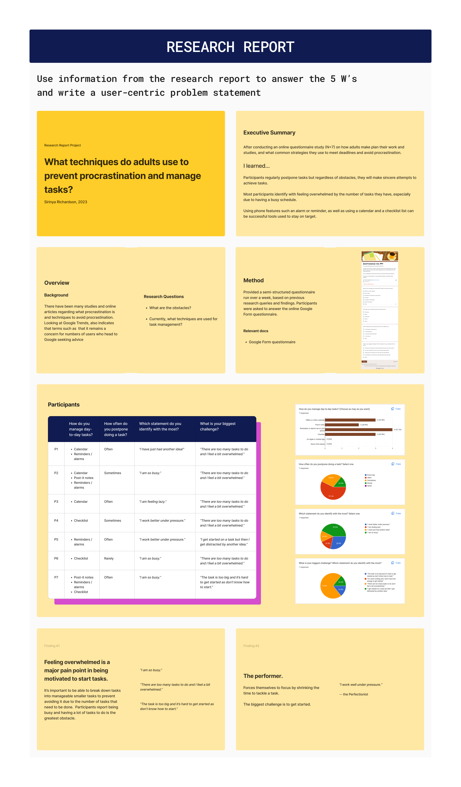
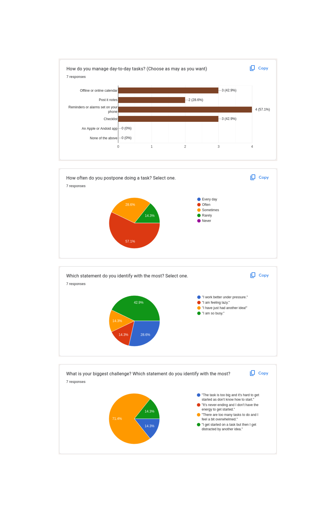
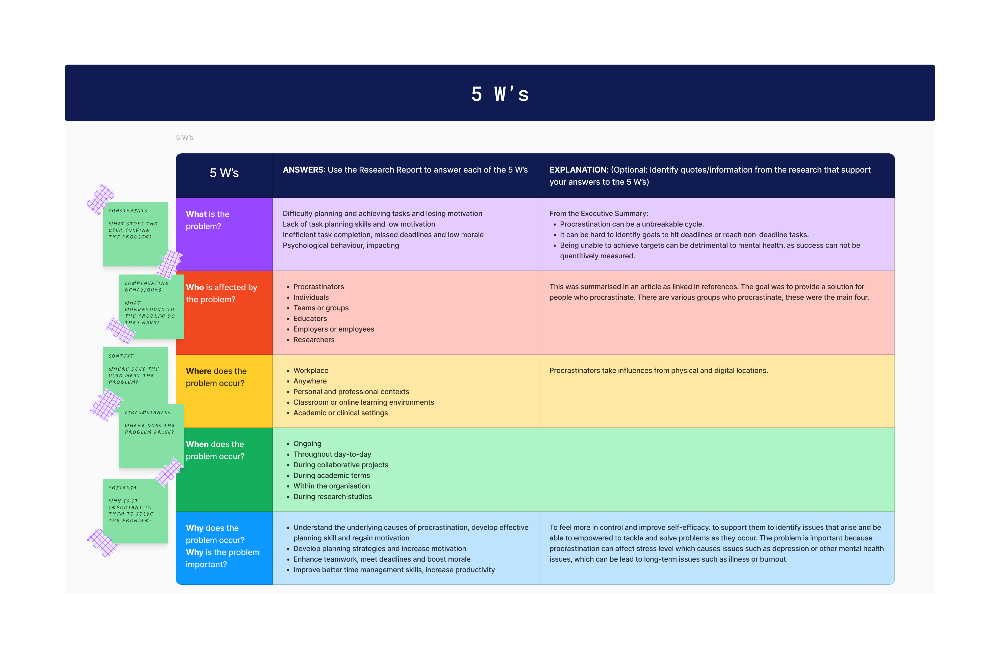
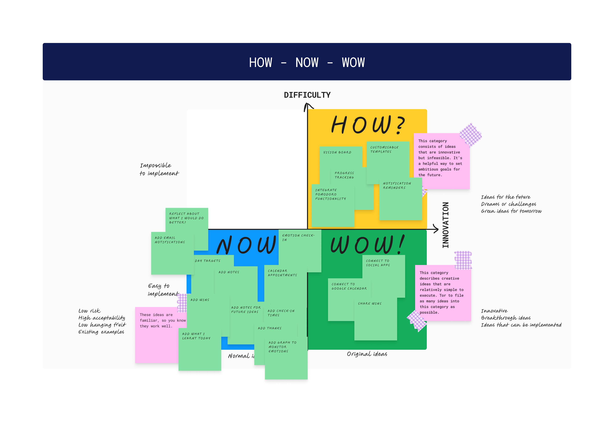
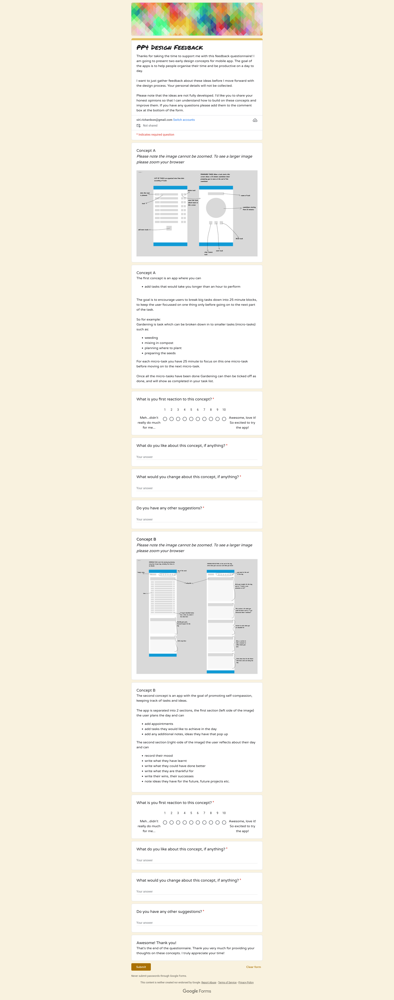
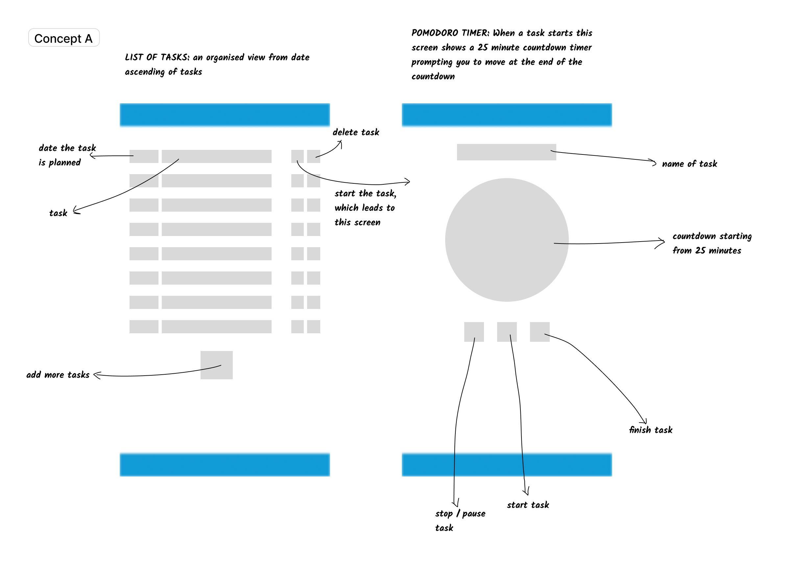
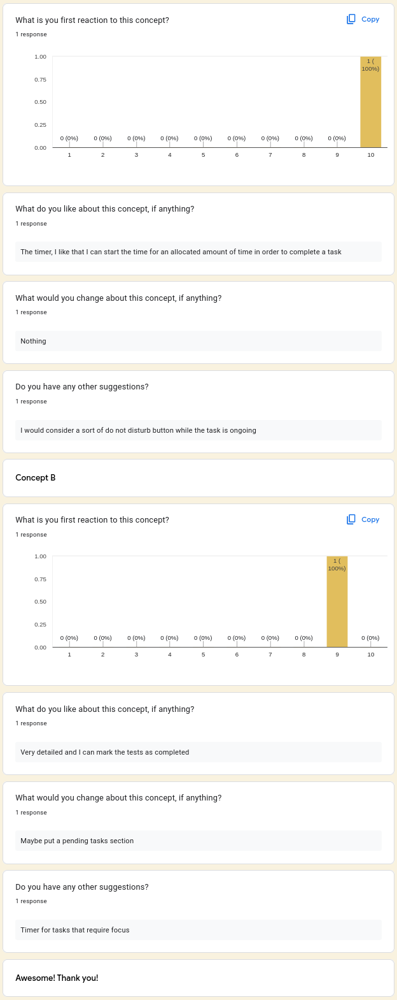
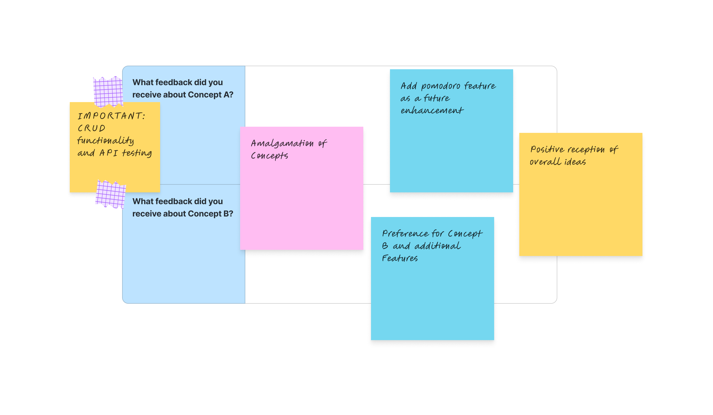
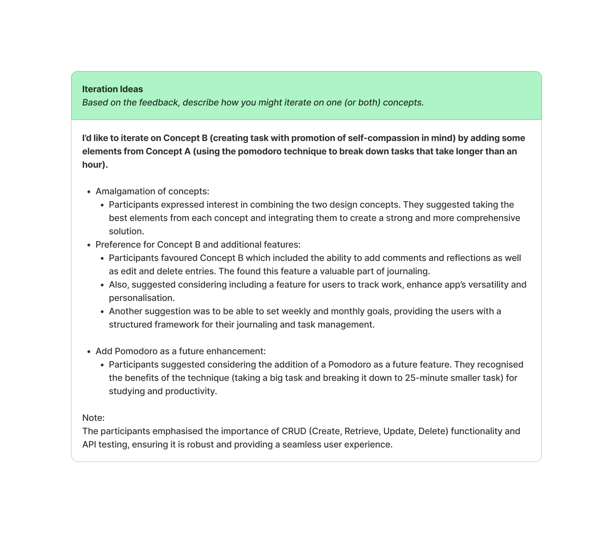

<!-- omit from toc -->
# Design Thinking

[*Return to main README file*](../../../README.md)

For the full overview produced in [Figma](https://figma.com), please see [Mindful Minutes - Define Ideate FigJam Board](https://www.figma.com/file/7rtFy0K92UjWxtJk84oh6D/Define-and-Ideate?type=whiteboard&node-id=0%3A1&t=cB3V7QtiU6YaSUpv-1).

<!-- omit from toc -->
## Table of Contents
- [Inspiration](#inspiration)
- [Research Report](#research-report)
- [Initial Questionnaire](#initial-questionnaire)
- [5Ws](#5ws)
- [Problem Statement](#problem-statement)
- [How-Now-Wow](#how-now-wow)
- [Design Feedback Questionnaire](#design-feedback-questionnaire)
  - [The (Drafted) Concepts](#the-drafted-concepts)
  - [Reflection \& Iteration Ideas](#reflection--iteration-ideas)

<a class="top-link hide" href="#top">↑</a>

[Design Thinking Diagram on FigmaJam](https://www.figma.com/file/7rtFy0K92UjWxtJk84oh6D/Define-and-Ideate?type=whiteboard&node-id=0%3A1&t=U2UiLCfcAOVAZf6c-1)

## Inspiration

After coming across a post shared on LinkedIn, I found inspiration to create a journal app that could provide immense value to individuals like them. The LinkedIn connection expressed their struggle to find a journal that effectively helped them stay organised and track their progress towards their goals. As they embarked on their diploma in Full-Stack Development, they discoverd a journal that became an essential part of their daily routine. Recognising the significance of such a tool in their own life, they expressed a desire to help others benefit from a similar journalling experience. Motivated by their story, I am developing a Django journal app to provide uses with a platform to stay organised, set goals, track achievements and foster a habit of introspection. By offering a user-friendly interface and intuitive features, this app aims to empower individuals to make the most of their daily experiences and achieve personal growth.

## Research Report

## Initial Questionnaire

  
Results from initial questionnaire

  

## 5Ws

The table can serve as a foundation for brainstorming and designing potential solutions using the Design Thinking approach, and provides a starting point for identifying:

- **Who**
  - the key stakeholders
- **What**
  - the problem and its manifestations
- **When**
  - the time-frame
- **Where**
  - the contexts in which the problems occurs
- **Why**
  - motivations behind addressing the problem

In summary individuals struggle with procrastination, finding it challenging to start or complete tasks within the desired time-frame. This behaviour can occur in various aspects of their lives, including personal responsibilities and professional obligations. They may face difficulties in planning their tasks effectively, leading to a lack of structure and organisation in their work. Individuals may also experience a decline in motivation, finding it hard to maintain enthusiasm and drive to accomplish their goals.

The issues surrounding procrastination include poor task planning and low motivation which can affect individuals from their early year into adulthood. It can manifest in academic pursuits, career goals, personal projects and simple day-to-day tasks.

By addressing the problem, individuals aim to overcome their tendencies to procrastinate, develop robust planning strategies and enhance their overall motivation. They aspire to gain a better understanding of their underlying psychological factors contributing to procrastination and find effective methods to manage their time and task efficiently. Ultimately, the objective is to achieve a higher level of productivity with an emphasis on **introspection**, being able identify satisfaction in both personal and professional endeavours

## Problem Statement

The problem statement for individuals struggling with procrastination, difficulty in planning and achieving tasks, as well as, losing motivation can be formulated as follows:

> Individuals face challenges in effectively managing their tasks, as they struggle with chronic procrastination, inadequate planning skills and diminishing motivation. This issue persists throughout their lives, impacting personal and professional contexts, hindering their ability to meet deadlines, achieve goals and maintain a sense of motivation. As a result, there is a pressing need to understand the root causes of procrastination, develop practical planning strategies and reignite individuals' motivation to enable them to over these obstacles and enhance their overall productivity and fulfilment.

References:
- [The Procrastination Group](https://procrastination.ca)
- [MindTools - Overcoming Procrastination](https://www.mindtools.com/a5plzk8/how-to-stop-procrastinating)
- [Verywell Mind - Understanding and Overcoming Procrastination](https://www.verywellmind.com/what-is-maslows-hierarchy-of-needs-4136760)
- [TED Talk by Tim Urban: "Inside the mind of a master procrastinator"](https://www.ted.com/talks/tim_urban_inside_the_mind_of_a_master_procrastinator/c)

## How-Now-Wow

The **How-Now-Wow** diagram provide a range of ideas for creating an app that addresses that problem at hand.

- **How** section
  - covers essential features and functions
- **Now** section
  - includes feasible ideas for immediate implementation
- **Wow** section
  - explores the innovative and advanced concepts that could have a significant impact on user experience

## Design Feedback Questionnaire

### The (Drafted) Concepts

Drafts were created in [Figma](https://figma.com). Please see the [drafts for Concept A & B in Figma](https://www.figma.com/file/0dqJufUdcM2ZNwxmbKpLzZ/Design-Feedback-(Concept-A-%26-B)?type=design&node-id=0%3A1&t=7BN0IWFqODDsJggl-1).

  
Concept A

  

  **Concept A** Draft with annotations

  
Concept B

  

  **Concept B** Draft with annotations

### Reflection & Iteration Ideas

  
Results from design feedback questionnaire

  

  Overall, the participant had a positive reaction to the concept of the app, appreciating the timer feature and the ability to mark tasks as completed. They provided valuable feed on including a "do not disturb" button, adding a pending tasks section and incorporating a timer for tasks that require focus. These suggestions can be considered for improving the concept and enhancing the user experience of the app. 

  Note:

  This feedback report is based on the input and feedback provided by a single participant. As there is only one participant, it was important to consider gathering feedback from a larger and diverse group of participants to obtain a more comprehensive and representative understanding fo user perspective and preferences.

Due to requiring further data, I asked to present the questionnaire in one of the weekly cohort stand-up meetings, where the following were present:
- Rebecca Tracey-Timoney
- Tomislav Dukez
- Hope Tracy Njoroge

Based on the feedback received during the stand-up meeting, I (the design team) should consider integrating the best elements from both concepts to create a well-rounded solution. The participants' positive reception of the mobile-first design, emphasis on CRUD functionality and suggestions for additional features provide valuable insights for further refining the design and improving user experience.

