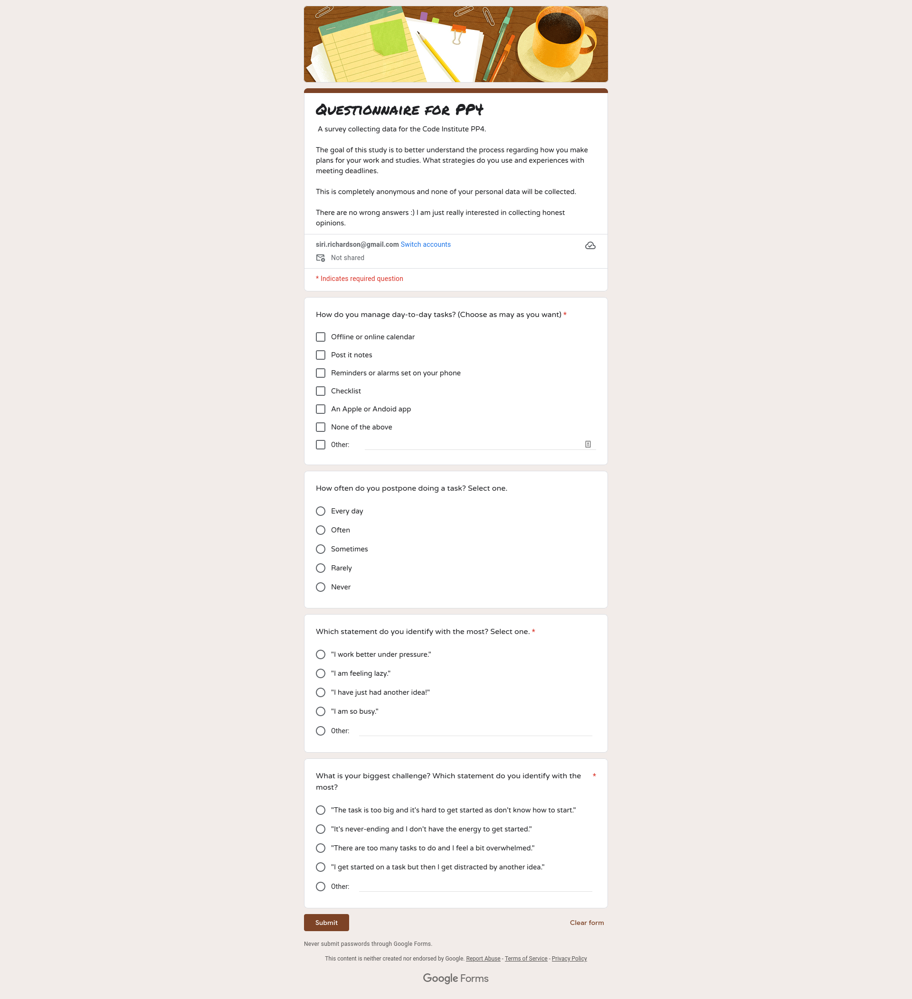
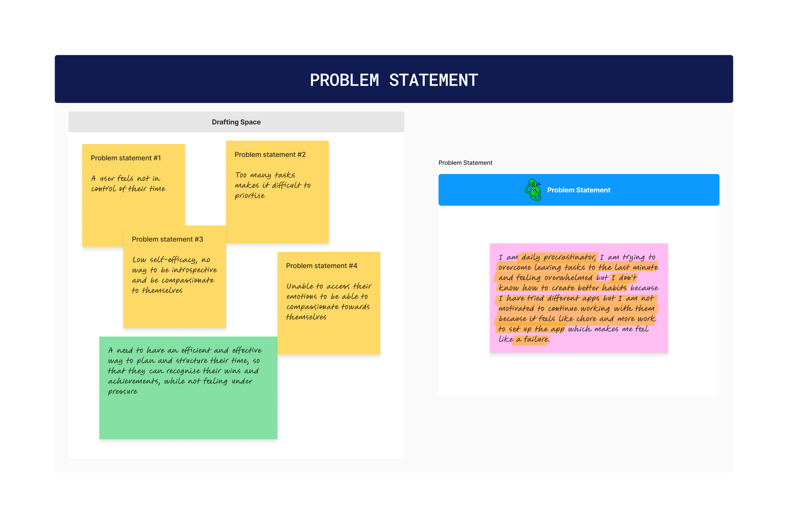
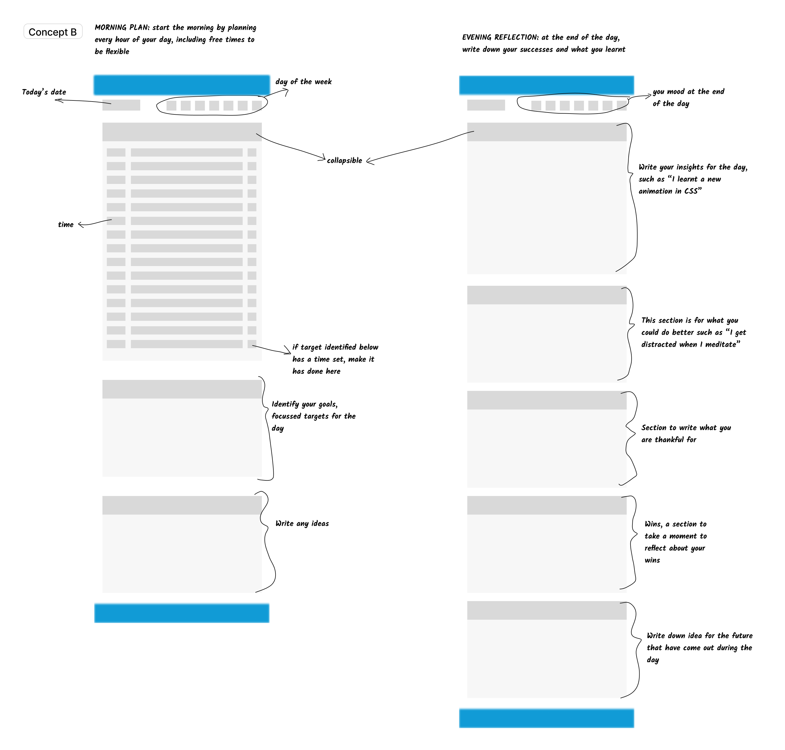

<!-- omit from toc -->
# Design Thinking

<!-- omit from toc -->
## Table of Contents
- [Research Report](#research-report)
- [Initial Questionnaire](#initial-questionnaire)
- [5Ws](#5ws)
- [Problem Statement](#problem-statement)
- [How-Now-Wow](#how-now-wow)
- [Design Feedback Questionnaire](#design-feedback-questionnaire)
  - [The (Drafted) Concepts](#the-drafted-concepts)
  - [Reflection \& Iteration Ideas](#reflection--iteration-ideas)

[Design Thinking Diagram on FigmaJam](https://www.figma.com/file/7rtFy0K92UjWxtJk84oh6D/Define-and-Ideate?type=whiteboard&node-id=0%3A1&t=U2UiLCfcAOVAZf6c-1)

## Research Report

## Initial Questionnaire

## 5Ws

The table can serve as a foundation for brainstorming and designing potential solutions using the Design Thinking approach, and provides a starting point for identifying:

- **Who**
  - the key stakeholders
- **What**
  - the problem and its manifestations
- **When**
  - the time-frame
- **Where**
  - the contexts in which the problems occurs
- **Why**
  - motivations behind addressing the problem

In summary individuals struggle with procrastination, finding it challenging to start or complete tasks within the desired time-frame. This behaviour can occur in various aspects of their lives, including personal responsibilities and professional obligations. They may face difficulties in planning their tasks effectively, leading to a lack of structure and organisation in their work. Individuals may also experience a decline in motivation, finding it hard to maintain enthusiasm and drive to accomplish their goals.

The issues surrounding procrastination include poor task planning and low motivation which can affect individuals from their early year into adulthood. It can manifest in academic pursuits, career goals, personal projects and simple day-to-day tasks.

By addressing the problem, individuals aim to overcome their tendencies to procrastinate, develop robust planning strategies and enhance their overall motivation. They aspire to gain a better understanding of their underlying psychological factors contributing to procrastination and find effective methods to manage their time and task efficiently. Ultimately, the objective is to achieve a higher level of productivity with an emphasis on **introspection**, being able identify satisfaction in both personal and professional endeavours

## Problem Statement

The problem statement for individuals struggling with procrastination, difficulty in planning and achieving tasks, as well as, losing motivation can be formulated as follows:

> Individuals face challenges in effectively managing their tasks, as they struggle with chronic procrastination, inadequate planning skills and diminishing motivation. This issue persists throughout their lives, impacting personal and professional contexts, hindering their ability to meet deadlines, achieve goals and maintain a sense of motivation. As a result, there is a pressing need to understand the root causes of procrastination, develop practical planning strategies and reignite individuals' motivation to enable them to over these obstacles and enhance their overall productivity and fulfilment.

References:
- [The Procrastination Group](https://procrastination.ca)
- [MindTools - Overcoming Procrastination](https://www.mindtools.com/a5plzk8/how-to-stop-procrastinating)
- [Verywell Mind - Understanding and Overcoming Procrastination](https://www.verywellmind.com/what-is-maslows-hierarchy-of-needs-4136760)
- [TED Talk by Tim Urban: "Inside the mind of a master procrastinator"](https://www.ted.com/talks/tim_urban_inside_the_mind_of_a_master_procrastinator/c)

## How-Now-Wow

The **How-Now-Wow** diagram provide a range of ideas for creating an app that addresses that problem at hand.

- **How** section
  - covers essential features and functions
- **Now** section
  - includes feasible ideas for immediate implementation
- **Wow** section
  - explores the innovative and advanced concepts that could have a significant impact on user experience

## Design Feedback Questionnaire

### The (Drafted) Concepts

  
Concept A

  

  **Concept A** Draft with annotations

  
Concept B

  

  **Concept B** Draft with annotations

### Reflection & Iteration Ideas

_Based on the feedback, how would I iterate on one (or both) concepts?_

I would like to iterated on Concept B.

In the new iteration:
- Fact 1

